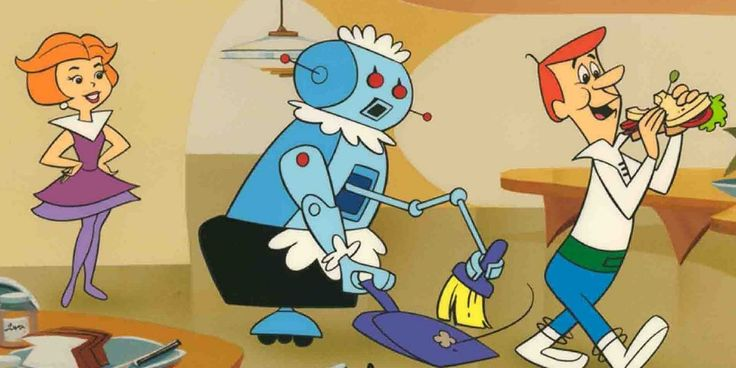
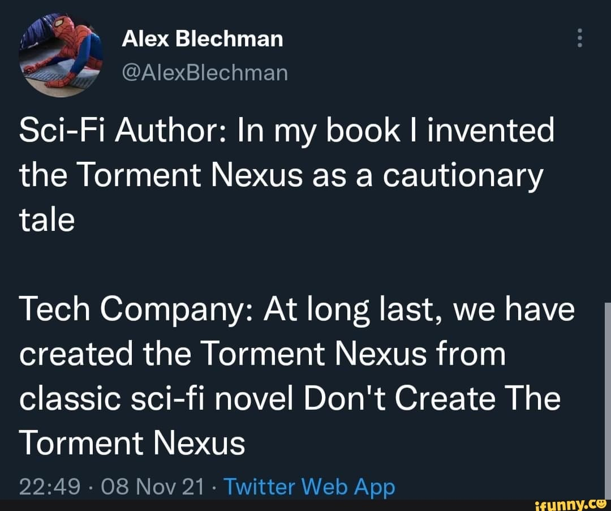
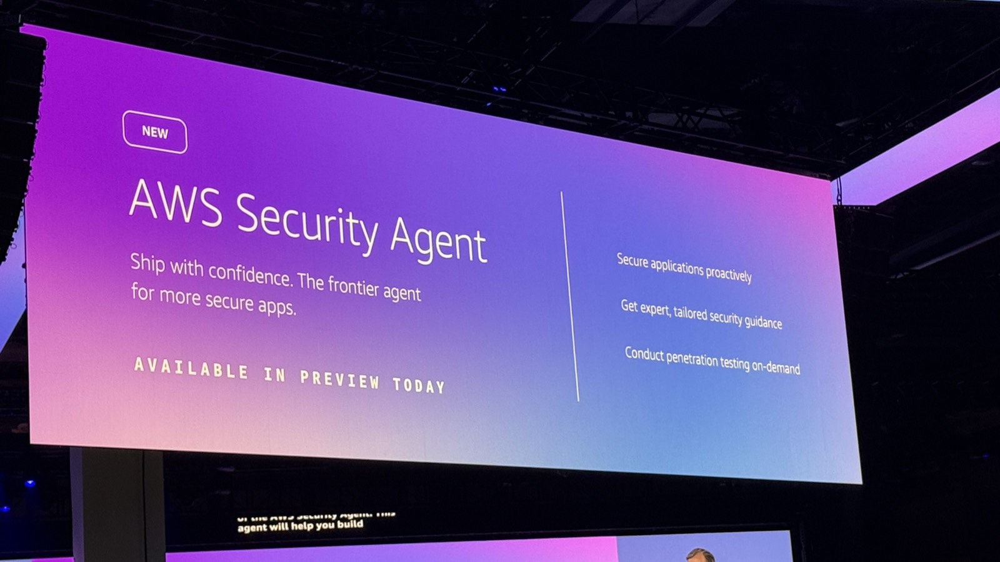

## I could accidentally hack my gym

[Earlier this month in Australia](https://www.abc.net.au/news/2026-08-10/ai-assistant-hacks-gym-website-aus-cyber-attack/107007986), a man called Andrew did a thing. He booked a gym class... using AI.

OpenClaw is a wrapper that allows you to use an AI like Claude to basically act as a personal assistant. On this day, OpenClaw was being used to book a gym class and, as you can guess from the title, the agent hacked the gym to secure a slot for our protagonist Andrew.

It's being called the first known autonomous cyberattack in Australia, and it won't be the last. We need to brace for a world where the next cyber attack we respond to might be some guy with an autonomous AI agent.

## Who is responsible?

If you believe the Australian court system, no one knows... There is no precedent; no case law. I'm not in law, so I don't want to comment too much, but I wouldn't be surprised if no one gets blamed. If I had to compare it to something, it would be Tesla autopilot killing innocent pedestrians and then settling out of court [like this case in September of 2025](https://www.peter-thompson-associates.com/news/tesla-settles-lawsuit-over-autopilot-crash/).

But it's going to happen more often as AI becomes better at compromising systems and society moves to adopting more and more local instances of AI. I imagine we are probably not so far away from the average Joe instructing a robot maid or secretary to do these kinds of chores. Actually, **I worry it's going to dilute the consequences** of getting caught trying to compromise systems, but we just don't know.

## Just get rid of the Torment Nexus!

> 

The reflex I keep hearing is: blame the technology. _Stop building Skynet. Just stop the machines from being able to hack in the first place._ Switch off the **torment nexus** and us law-abiding citizens can all feel safe again, assuming we weren't too late.

**It's too late**

It's been too late for at least a few years now. I'm not talking about future generations of models. I leave that to the AI alignment experts. From a cybersecurity perspective, we can already [download state-of-the-art models (Kimi K3)](https://huggingface.co/moonshotai/Kimi-K3) and you can run it with no guardrails, and they are here to stay.

Actually, the biggest barrier to entry is the absolutely nutty pricing of the RAM and GPU market, as well as the energy market not being able to keep up. What this means is these attacks are not at their peak volume. The avalanche of autonomous hacking has only begun, and the tsunami of "gym bookings" is only going to get worse.

## AWS is offering VHaaS (Vibe Hacking as a Service)

I'm only half joking. AWS Security Agent wires an autonomous agent into your CI/CD that runs real penetration tests on every build with multi-step attack scenarios across the OWASP Top 10, with reproducible exploit paths and ready-to-apply fixes. It's autonomous pentesting pointed at your own apps with your sign-off. AWS doesn't say exactly how it's fenced off, though, so you're trusting a goal-seeking LLM to find and run working exploits without wandering into prod.

Same capability as the gym agent, just pointed on purpose. Offense and defense are collapsing onto the same primitive: _cybersecurity isn't adjacent to AI anymore, it's becoming the same job._

## Conclusion

So what's the takeaway?

AI is collapsing the cost of attack and defense at the same time. That cuts both ways: trivial issues get patched faster than ever, but the attack surface is expanding exponentially, and the patch cycle isn't keeping up. The floor just dropped out. The average script kiddie with a Claude subscription is now punching at a level that used to take real skill, or they are getting Claude to book a doctor's appointment. They are becoming a mini Mr. Robot for twenty bucks a month.

For me, that underlines one thing: red team engagements and adversarial tooling matter _more_ now than ever before. The whole game is to find and fix the unlocked-door API before somebody's gym-booking agent stumbles into it for you. You want to be weeding out that missing authorization check faster than the average Joe can sign up for an agent and ask it to get him into a spin class.

I don't think the answer is to knee-cap AI. I'll leave that argument to the AI safety people. It's their lane, not mine.

Mine is making sure the door's locked before the accidental attacker tries the handle.
